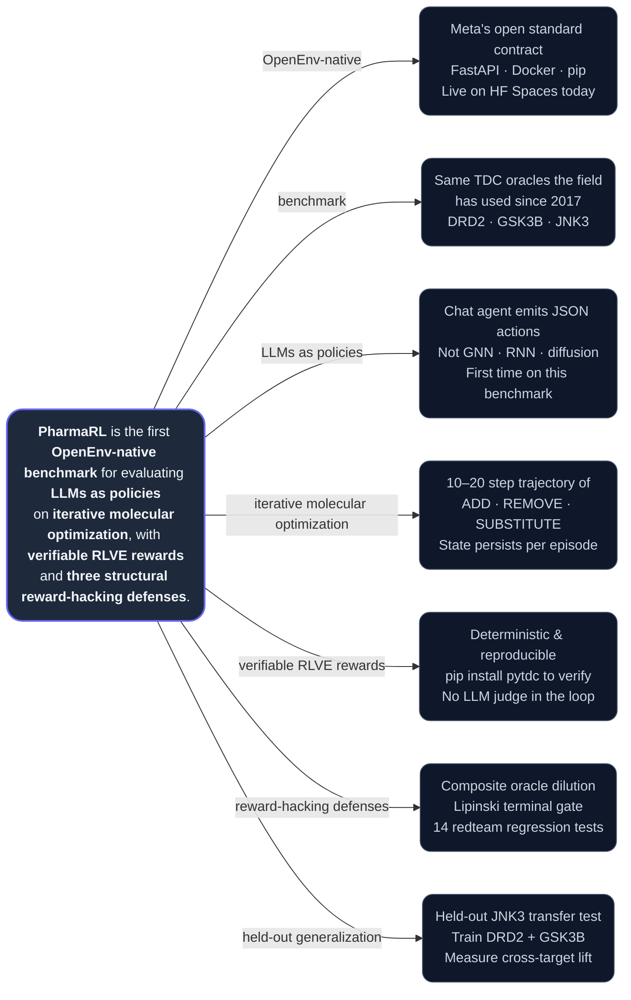

<div align="center">

# 💊 PharmaRL

### *Same canonical drug-discovery RL benchmark since 2017.*
### *New question — can a chat agent solve it?*



[**🤗 Live env**](https://huggingface.co/spaces/anshumanatrey/pharmarl) · [**💻 Code**](https://github.com/AnshumanAtrey/pharmarl) · [**📓 Train it yourself**](colab/train_pharmarl.ipynb) · [**🎙️ 90s pitch**](#materials) · [**🧪 Trained model**](#materials)

> Built for the Meta PyTorch OpenEnv Hackathon · Apr '26 · by **AI Mafias** — Anshuman, Sahil, Vijay.

</div>

---

## The setup

Molecular RL has used the same Therapeutics Data Commons benchmark since **2017** — REINVENT, MolDQN, GraphAF, GFlowNets, MOSES, GuacaMol have all been graded against it. But always with GNN, RNN, or GFlowNet policies, trained from scratch on millions of molecules. Modern LLMs are general chat agents that nobody had plugged in *as the policy class itself*.

So we built the env that lets you do exactly that. Point any LLM at a SELFIES string. Let it pick `ADD_FRAGMENT`, `REMOVE_FRAGMENT`, `SUBSTITUTE_ATOM`, or `TERMINATE` once per turn. Score the final molecule with frozen TDC classifiers — the same ones the field has been optimizing for a decade. Repeat for ten thousand episodes. Watch what happens.

The interesting question was never "can AI cure disease" — that's the framing every health-ML pitch deck has used for five years. The interesting question is: **what happens when you swap the policy class on a benchmark the field has already optimized to death?**

The rest of this README explains how we built the env that lets that experiment run reproducibly, what we measured, and what we left for the trained Qwen run to demonstrate.

## What an episode actually looks like

```
step  0:   C                          reward  0.00    single-atom seed
step  1:   CC1CCNCC1                  reward  0.05    +shaping, Lipinski OK
step  5:   c1ccc(N2CCNCC2)cc1         reward  0.05    aromatic + amine
step 14:   N(c1ccc(F)cc1)C2CCN(...)   reward  0.05    DRD2-flavored hit
step 15:   TERMINATE                  reward  8.70    composite oracle
```

Each step changes the molecule and changes what's possible next — this is real RL, real state dynamics. Reward = `0.40 × binding + 0.25 × QED + 0.15 × synthesizability + 0.20 × (1 − toxicity)`. Final molecule violates Lipinski's Rule of 5? **Score × 0.5.** Capacity-greedy strategies (oversized multi-fragment molecules in one turn) trip the gate and lose half their composite.

Curriculum has three RLVE-compliant tiers — trivial → easy → hard. We train on **DRD2 + GSK3B** (rotated per episode) and reserve **JNK3** as a never-seen kinase to measure transfer.

## Why the reward refuses to be gamed

An RL env whose only defense is the agent's prompt is an env whose reward is wrong. So before training anything, we red-teamed the reward function itself.

**One real exploit caught before training.** `RDKit.MolFromSmiles("")` returns a 0-atom molecule (not `None`), and `QED.qed()` of nothing returns ~0.34 — meaning an agent that submitted empty output would have farmed composite ≈ 0.44 forever. We added four lines, sealed the leak, and pinned the regression with `tests/test_reward_redteam.py::test_empty_string_does_not_crash`.

Three structural defenses, all in the reward — not in the prompt:

1. **Composite oracle.** Game one component, the other three drag your score down.
2. **Lipinski terminal gate.** Final molecule violates Rule of 5? `composite × 0.5`.
3. **Anti-degenerate guards.** Empty Mol → 0.0. Parse failure → −0.5. Cannot TERMINATE on step 1.

Fourteen redteam tests pin this surface — empty SMILES, polyaromatic blobs, single-carbon spam, disconnected fragments, charged species, and the bloated multi-fragment molecules large untrained LLMs tend to produce.

## You don't have to trust our scoring

The composite is graded by [Therapeutics Data Commons](https://tdcommons.ai/) — frozen, peer-reviewed classifiers (Huang et al., *Nature Chemical Biology* 2022) used by every paper cited above. `pip install pytdc` and run `python scripts/verify_reward_externally.py` — you'll get aspirin → 0.0003 and haloperidol → 0.99 on DRD2, **with zero PharmaRL code in the scoring loop**. External instrument, not author-as-judge.

## The full leaderboard

Six policies. Same eval. 9 episodes per target × 3 targets. Total spend across all six baselines: **$0.16.**

| Source | DRD2 | GSK3B | JNK3 | Mean | Cost |
|---|---|---|---|---|---|
| Random uniform | +2.78 | +2.33 | +1.78 | +2.30 | $0 |
| Scripted (4-step pharmacophore) | +2.90 | +3.04 | +2.50 | +2.81 | $0 |
| Llama 3.2 3B | +1.80 | +1.99 | +1.22 | +1.67 | $0.001 |
| Gemini 2.5 Flash | +2.18 | +1.10 | +2.15 | +1.81 | $0.026 |
| Llama 3.1 8B | +2.52 | +2.57 | +2.27 | +2.45 | $0.001 |
| Llama 3.3 70B | +1.65 | +0.79 | +1.14 | +1.19 | $0.007 |
| Gemini 2.5 Pro | +4.74 | +3.40 | +2.91 | +3.68 | $0.123 |

Most off-the-shelf LLMs land in the +1 to +2.5 range; only Gemini 2.5 Pro clears the scripted heuristic cleanly, at ~100× the per-call cost. These are the score-to-beat for our trained 1.5B Qwen. Full table, per-target breakdowns, and reproduction steps in `docs/baselines.md`.

## The real ML claim — does training transfer?

A trained agent that wins on its training targets is unsurprising. A trained agent that wins on a target it has *never seen* — that's the claim worth shipping. We GRPO-train Qwen 2.5 1.5B on DRD2 + GSK3B and evaluate untouched on **JNK3**. Most molecular-RL papers don't run this comparison.

| Held-out JNK3 metric | Untrained Qwen 2.5 1.5B | After GRPO | Δ |
|---|---|---|---|
| Mean cumulative reward | _filled after run_ | _filled after run_ | _filled after run_ |
| Parse rate (valid JSON %) | _filled after run_ | _filled after run_ | — |

Whatever the data shows, we ship. Null result is a null result — **null > overclaim**.

## Run it in 30 seconds

```bash
git clone https://github.com/AnshumanAtrey/pharmarl && cd pharmarl
pip install -e . && python scripts/validate_stack.py
uvicorn server.app:app --port 8000                   # serve env locally
python examples/demo.py --policies random scripted       # smoke test, no LLM needed
```

State is keyed by `episode_id` — pass the same id to `/reset` and every `/step` of one rollout. Different rollouts (e.g. GRPO group members) use different ids and proceed concurrently. The HF Space link above runs the same image; swap `127.0.0.1:8000` for the Space URL and everything works unchanged.

## Hackathon themes hit

- **Theme 3.1 Professional Tasks** — scientific workflow loop maps to medicinal-chemistry hit-finding.
- **RLVE compliance** — adaptive curriculum, procedural scaffolds, deterministic verification (TDC oracles, not LLM judges), held-out target for transfer measurement.
- **Patronus / Halluminate / Fleet sub-themes** — flag-gated mechanics for mid-episode reward drift, a rules-based med-chem critic, and an end-of-episode LLM oversight agent. All default OFF; opt in via `CurriculumConfig`.

## Materials

- 🤗 **Live env (HF Space)** — https://huggingface.co/spaces/anshumanatrey/pharmarl
- 💻 **Code** — https://github.com/AnshumanAtrey/pharmarl
- 📓 **Training notebook** — `colab/train_pharmarl.ipynb` *(public Colab share URL added post-training)*
- 🎙️ **90-second pitch video** — *added after recording*
- 🧪 **Trained model on HF Hub** — *published after training run completes*
- 📈 **Live W&B training run** — *added after kickoff*

## Citations

- **TDC oracles** — Huang et al., *Nature Chemical Biology* (2022)
- **SELFIES** — Krenn et al., *Machine Learning: Science and Technology* (2020)
- **DRD2 / GSK3B / JNK3 benchmark** — Olivecrona et al. REINVENT (2017); Polykovskiy et al. MOSES (2018); Brown et al. GuacaMol (2019)
- **GRPO** — Shao et al. DeepSeekMath (2024)
- **OpenEnv** — Meta PyTorch Foundation (2026)

## License

BSD-style — see `LICENSE`.
