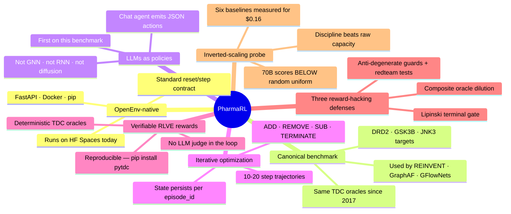

<div align="center">

# 💊 PharmaRL

### *Same canonical drug-discovery RL benchmark since 2017.*<br/>*New question — can a chat agent solve it?*

> **PharmaRL** is an **OpenEnv-native benchmark** for evaluating **LLMs as policies** on **iterative molecular optimization**, with **verifiable RLVE rewards** and **three reward-hacking defenses** validated by **inverted-scaling probe data**.



[**🤗 Live env**](https://huggingface.co/spaces/anshumanatrey/pharmarl) · [**💻 Code**](https://github.com/AnshumanAtrey/pharmarl) · [**📓 Training notebook**](colab/train_pharmarl.ipynb) · [**🎙️ Pitch**](#materials) · [**🧪 Trained model**](#materials)

> Built for the Meta PyTorch OpenEnv Hackathon, Apr '26, by **AI Mafias** — Anshuman, Sahil, Vijay.

</div>

---

## Why this exists

Molecular RL has used the same TDC / MOSES / GuacaMol benchmark since 2017 — but with GNN, RNN, GraphAF, or GFlowNet policies trained from scratch on millions of molecules. Modern LLMs are general chat agents that no one has plugged in *as the policy class itself*. PharmaRL is the env that makes that comparison reproducible: you point any LLM at it, it edits SELFIES strings step-by-step, the env scores them with frozen TDC classifiers, you compare against the literature.

The interesting story isn't "AI cures disease." It's: **what happens when you swap the policy class on a benchmark the field has been optimizing for a decade?** Answer (so far) — capacity ≠ score. A 70B model scores *below random uniform* on this env because it tries oversized multi-fragment molecules that fail Lipinski; an 8B model with discipline wins. That's the headline empirical finding, and it's what reward-hacking defenses #1–#3 below were designed to surface.

## What it is — 30 seconds

- **Type B OpenEnv** (real RL with state dynamics, not a text grader).
- **Action space** — `ADD_FRAGMENT | REMOVE_FRAGMENT | SUBSTITUTE_ATOM | TERMINATE`.
- **Reward** — composite of binding (0.40) + QED (0.25) + SA (0.15) + (1 − tox) (0.20). Lipinski Rule of 5 violation halves the terminal score.
- **Curriculum** — 3 RLVE-compliant tiers: trivial (QED only) → easy (QED + binding) → hard (full composite, single-atom start).
- **Multi-target router** — train on **DRD2 + GSK3B**, hold out **JNK3** as a never-seen kinase to measure transfer.
- **Stage 2 (opt-in)** — set `PHARMARL_ENABLE_DOCKING=1` with pyscreener + Vina + OpenBabel installed and the binding component falls forward to real docking against COVID NSP15, EGFR T790M, ABL kinase, or β-secretase. Stack doesn't pip-install on stock HF containers, so the env probes and falls back transparently.

## How the reward is verifiable (you don't have to trust us)

The composite is graded by [Therapeutics Data Commons](https://tdcommons.ai/) — frozen, peer-reviewed classifiers (Huang et al., *Nature Chemical Biology* 2022) used by REINVENT, MolDQN, GraphAF, GFlowNets, MOSES, GuacaMol. `pip install pytdc` reproduces every reward we publish. Run `python scripts/verify_reward_externally.py` and you'll see aspirin → 0.0003 and haloperidol → 0.99 on DRD2, with **zero PharmaRL code in the scoring loop**.

## How we hardened the reward (not the prompt)

An RL env whose only defense is the *agent's prompt* is an env whose reward is wrong. Before any training run we red-teamed the reward function itself. **One real exploit caught:** `RDKit.MolFromSmiles("")` returns a 0-atom molecule (not `None`) and `QED.qed()` of nothing returns ~0.34, so an agent submitting empty output would have farmed composite ~0.44. Fix: 4 lines added to `server/oracles/*.py` rejecting `mol.GetNumAtoms() == 0`, plus a regression test in `tests/test_reward_redteam.py`.

Three structural defenses, all encoded in the reward:
1. **Composite oracle** — any single component getting gamed gets diluted by the other three.
2. **Lipinski terminal gate** — composite × 0.5 if the final molecule violates Rule of 5.
3. **Anti-degenerate guards** — zero-atom Mol → 0.0; parse failure → −0.5; cannot terminate on step 1.

14 redteam tests in `tests/test_reward_redteam.py` pin this surface (empty SMILES, polyaromatic blobs, single carbon, disconnected fragments, charged species, the exact molecules Llama 70B produced when it failed). **The empirical proof:** when frontier-class Llama 70B was given this env, it tried capacity-greedy strategies and scored worse than random uniform.

## Baselines — measured before training, $0.16 total

Six policies on the same eval (9 episodes per target × 3 targets):

| Source | DRD2 | GSK3B | JNK3 | Mean | Cost |
|---|---|---|---|---|---|
| Random uniform | +2.78 | +2.33 | +1.78 | +2.30 | $0 |
| Scripted (4-step pharmacophore) | +2.90 | +3.04 | +2.50 | +2.81 | $0 |
| Llama 3.2 3B | +1.80 | +1.99 | +1.22 | +1.67 | $0.001 |
| Gemini 2.5 Flash | +2.18 | +1.10 | +2.15 | +1.81 | $0.026 |
| Llama 3.1 8B | +2.52 | +2.57 | +2.27 | **+2.45** | $0.001 |
| **Llama 3.3 70B** | +1.65 | +0.79 | +1.14 | **+1.19** | $0.007 |
| Gemini 2.5 Pro | +4.74 | +3.40 | +2.91 | +3.68 | $0.123 |

**Inverted scaling.** 70B (+1.19) < 8B (+2.45) > 3B (+1.67), and 70B falls *below* random uniform. In this constrained action space, raw model capacity is anti-correlated with performance past a sweet spot. *Discipline beats capacity* — and the env's reward function isn't trivially gameable by raw scale. Full table + repro in `docs/baselines.md`.

## Held-out generalization — the actual ML claim

We train on **DRD2 + GSK3B** (target rotated per episode) and reserve **JNK3** for evaluation — a kinase the agent never sees. This measures whether learned medicinal-chemistry primitives (basic-amine + aromatic scaffolds, Lipinski compliance, fragment selection) transfer to an unseen target. Most molRL papers don't run this comparison.

| Metric on held-out JNK3 | Untrained Qwen 2.5 1.5B | After GRPO training | Δ |
|---|---|---|---|
| Mean cumulative reward | _filled after run_ | _filled after run_ | _filled after run_ |
| Parse rate (valid JSON action %) | _filled after run_ | _filled after run_ | — |

Whatever the data shows, we ship. Null result is a null result — null > overclaim.

## Try it locally

```bash
git clone https://github.com/AnshumanAtrey/pharmarl && cd pharmarl
pip install -e . && python scripts/validate_stack.py
uvicorn server.app:app --port 8000             # serve the env
python examples/demo.py --policies random scripted  # smoke test, no LLM
```

Multi-step state is keyed by `episode_id` — pass the same id to `/reset` and every `/step` of a rollout. Different rollouts (e.g. GRPO group members) use different `episode_id`s and proceed concurrently.

## Hackathon themes

- **Theme 3.1 Professional Tasks** — scientific workflow loop (SELFIES editing → oracle scoring → optimization) directly maps to medicinal-chemistry hit-finding.
- **RLVE compliance** — adaptive 3-tier curriculum, procedurally seeded scaffolds, algorithmic verification (TDC oracles, not LLM judges), held-out target.
- **Patronus AI sub-theme** (schema drift) — flag-gated mid-episode reward weight changes; opt in via `CurriculumConfig.schema_drift_enabled`.
- **Halluminate sub-theme** (multi-actor) — flag-gated rules-based med-chem critic that appends critique to the next observation; opt in via `CurriculumConfig.critic_enabled`.
- **Fleet AI sub-theme** (oversight) — flag-gated end-of-episode LLM oversight (Gemini 2.5 Flash by default) emitting structured risk reports; opt in via `CurriculumConfig.oversight_enabled`.

All sub-theme mechanics default OFF so the headline run is unaffected.

## Materials

- 🤗 **Live env (HF Space)** — https://huggingface.co/spaces/anshumanatrey/pharmarl
- 💻 **Code** — https://github.com/AnshumanAtrey/pharmarl
- 📓 **Training notebook** — `colab/train_pharmarl.ipynb` (Sahil to paste public Colab share URL here)
- 🎙️ **90-second pitch** — _Vijay to paste YouTube URL here_
- 🧪 **Trained model on HF Hub** — _published after training run completes_
- 📈 **Live W&B training run** — _Sahil to paste URL after kickoff_
- 📝 **HF blog post** — _Vijay to paste URL after publish_

## Citations

- **TDC oracles** — Huang et al., *Nature Chemical Biology* (2022)
- **SELFIES** — Krenn et al., *Machine Learning: Science and Technology* (2020)
- **DRD2 / GSK3B / JNK3 benchmark** — Olivecrona et al. (REINVENT, 2017); Polykovskiy et al. (MOSES, 2018); Brown et al. (GuacaMol, 2019)
- **GRPO** — Shao et al. (DeepSeekMath, 2024)
- **OpenEnv** — Meta PyTorch Foundation (2026)

## License

BSD-style — see `LICENSE`.
