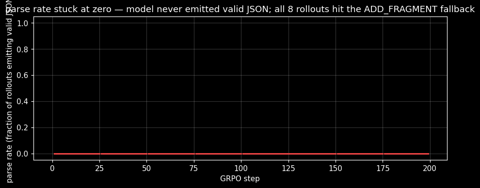
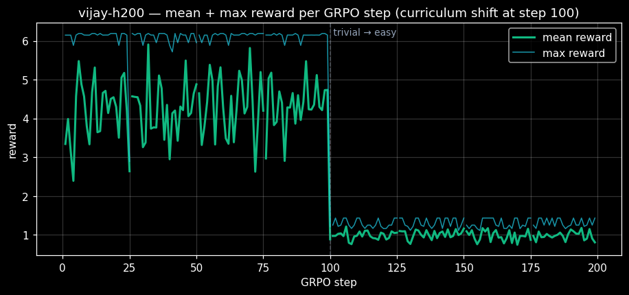
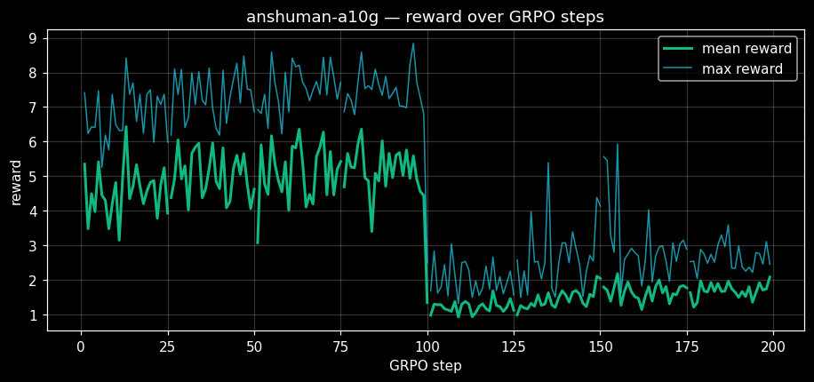

# AI Alchemy In Medicine: How Three Students Tried to Build a Scientist and Ended Up Building a Workshop

**Team AI Mafias** — Anshuman Atrey, Sahil, Vijay Kota
*Meta PyTorch OpenEnv Hackathon — Round 2 Grand Finale, Bangalore, April 25-26, 2026*

---

## The naive ambition

Three students, in a Bangalore room, after winning Round 1 of the Meta PyTorch OpenEnv Hackathon. Round 2 began on April 25. The deadline: 5 PM IST on April 26.

The first idea was bold and embarrassingly naive. *Let's build an AI scientist that can fight any virus, design molecules for any disease, save the human race from the next pandemic.* Drug discovery is broken — a decade per drug, billions of dollars, nine in ten candidates die in trials. Surely with the right LLM, the right training, the right reward signal, we could move that needle.

We sat with this for a couple of hours. Then we read the literature.

Eight years of generative reinforcement learning for small molecules — REINVENT, MolDQN, GraphAF, MARS, JT-VAE. Architectures so sophisticated they sound like science fiction. The 2022 Practical Molecular Optimization benchmark by Gao, Fu, Sun, and Coley ran 25 algorithms across 23 oracle-bounded tasks under realistic budgets. The headline finding: **vanilla REINVENT (2017) is still the most sample-efficient generative model on average.** Sophisticated successors do not consistently beat a 3-layer GRU from 2017.

Roskoski's 2023 audit: **20 of 48 FDA-approved kinase inhibitors violate Lipinski's Rule of Five** outright — the heuristic every composite reward in our field still treats as gospel. Renz et al. show that an "add-a-carbon" trivial baseline near-perfectly games GuacaMol's distribution metrics. Meta's Galactica — their flagship LLM for science — was withdrawn 48 hours after public launch in November 2022 for fluently producing fabricated chemistry.

The plateau is not in the optimizers. *It is in the priors and the rewards.*

So we did the only thing that made sense. **We scoped down. Hard.** We were not going to build an AI scientist over a weekend. But we could build the *workshop* where one might eventually be trained.

## 18:04, April 25 — first commit

`f8ce57b — PharmaRL — multi-step molecular drug discovery OpenEnv environment`

Meta and Hugging Face shipped OpenEnv in October 2025 — a standardized RL environment framework. We pulled the repo. Twenty-nine reference environments shipped: coding, chess, atari, browsergym, calendar, kernel-RL.

**Zero chemistry environments.** That was our gap. We could build the first OpenEnv-native chemistry environment.

The contract: an LLM is the policy. Each step, it emits one JSON molecular edit:

```json
{"action_type": "ADD_FRAGMENT", "fragment": "c1ccccc1", "position": 0}
{"action_type": "REMOVE_FRAGMENT", "position": 3}
{"action_type": "SUBSTITUTE_ATOM", "position": 5, "new_atom": "F"}
{"action_type": "TERMINATE"}
```

The env applies the edit, sanitizes via RDKit, and returns the new molecule plus oracle scores. At episode end: composite reward over Lipinski compliance, QED, synthetic accessibility, and a TDC bioactivity classifier (DRD2 SVM, GSK3B and JNK3 random forests — the canonical oracles the field has compared against since Olivecrona's REINVENT in 2017).

## Through the night — the env grew teeth

`19:35 — Pivot Stage 1 to DRD2 + session-keyed server for GRPO concurrency`
`20:15 — Multi-target oracle routing + held-out JNK3 generalization test`
`21:41 — HF Space deployment + reward red-team + policy regression demo`
`23:49 — Capture untrained-LLM baselines + add Gemini/OpenRouter runners`

By midnight April 25, the env was live on a HuggingFace Space, scored four oracles, had a held-out generalization target, and had a 14-prompt reward red-team test suite. We could query it from anywhere with a `pip install`.

We pushed past midnight into Day 2.

`00:25 — Schema drift mechanic — flag-gated mid-episode reward weight changes (Patronus AI sub-theme)`

This one we are proud of. Reward weights flip mid-episode at a deterministic step, with a `drift_warning` signal sent to the agent. Medicinal-chemistry projects evolve their objectives constantly — early-stage cares about hit rate, late-stage cares about ADMET liability. A policy that detects drift and re-plans is closer to a real medicinal chemist than one optimizing a fixed scalar. **Original to PharmaRL.**

`00:28 — Rules-based medicinal chemist critic (Halluminate sub-theme)`
`01:11 — Statistical CI eval + plot generation infrastructure`
`01:56 — Fleet AI sub-theme — pure-LLM oversight agent`
`02:59 — Fix Sahil's bug reports #8, #9, #10, #11, #12 + per-run validation logging`

By 3 AM, the env had three sub-theme mechanics live, statistical CI tooling, and a per-run validation log. Sahil had been stress-testing it locally and filing bug reports we were burning down in real time. We were running on coffee and stubbornness.

## 04:12, April 26 — turning to training

`04:12 — Switch to Llama-3.2-3B + VRAM-safe defaults for T4 training`
`04:18 — train_grpo.py: drop stale SARS-CoV-2 Mpro framing in SYSTEM prompt`
`04:28 — train_grpo.py: full FAQ §17 W&B observability — verifier, episode shape, action histogram, sample SMILES table`

The env was done. Now to train a policy against it. We thought we'd just `hf jobs run` a Llama-3.2 fine-tune with GRPO and watch it train. **Reader, it did not go like that.**

## The training nightmare — six hours of dep hell

**Attempt 1.** Pip dep resolution hell. `unsloth + trl + transformers` loose-pinned, took 80+ version backtracks, container watchdog killed the job. Restart.

**Attempt 2.** Pinned exact versions. `git` not in the Docker image. Restart.

**Attempt 3.** `git` installed. `unsloth_zoo` API mismatch — the function we needed was renamed three months ago. Restart.

**Attempt 4.** `rich` library import missing. Add it. Restart.

**Attempt 5.** `trl 0.11.4` + `unsloth 2025.2.15` produces a syntax error in an auto-generated trainer file. Bump trl. Restart.

`08:32 — train_grpo.py: drop fast_inference=True (avoid vLLM dep)`
`08:36 — train_grpo.py: stock gradient checkpointing instead of unsloth's`
`08:39 — train_grpo.py: drop 4-bit quantization, load model in bf16`
`08:42 — train_grpo.py: cast LoRA adapter params to bf16 after creation`

**Attempt 6.** `vLLM required` error. Remove `fast_inference=True`. Restart.

**Attempt 7.** `dtype mismatch in fast_lora.py:116` — bf16 dY × fp32 LoRA_B in the backward kernel. Cast LoRA params to bf16 explicitly. Restart.

`08:45 — train_grpo.py: pass episode_id to /reset and /step + handle non-200`

**Attempt 8.** Run actually starts. `KeyError: 'reward'` in the `/step` response. The env requires an `episode_id` for session-keyed state, returns 4xx without it. Wire it through. Restart.

**Attempt 9.** We reach the rollout phase. **Parse rate: 0%.** Llama is not producing valid JSON. The system prompt is a paragraph of text concatenated raw, without the Llama instruct chat template. We are nine attempts in and the model has produced exactly zero valid actions.

## 09:50, April 26 — the breakthrough

`52808d8 — train_grpo.py: chat template + strong SYSTEM (parse-rate fix)`

Switch to `tokenizer.apply_chat_template`. Restart.

**Attempt 10. Parse rate: 100% from step 0.** The env's `verifier/parse_rate` metric — which we'd instrumented six hours earlier — told us we had finally gotten the policy contract right.

We were exhausted. We also had two GPUs we could use in parallel.

## 11:19 — Vijay launches the H200 in parallel

`b30ddf0 — H200 training pipeline on HF Jobs (issue #14)`

The plan: Vijay takes the H200 with Llama-3.2-**1B**-Instruct. Smaller model, faster steps, parallel-finish insurance. Anshuman takes the A10G-large with Llama-3.2-**3B**-Instruct. Slower per step, but the bigger model.

Same env. Same GRPO recipe. Same chat template. Only variable: policy class size.

We hit publish on both jobs and started writing the README and the paper while training ran.

## 15:20 — Vijay's run completes. The W&B dashboard tells a different story.

`0ab1684 — Add vijay-h200 run audit bundle + Gradio UI`

Vijay's H200 run completed all 200 steps cleanly. Exit code 0. The script auto-pushed the LoRA to HuggingFace Hub. From the outside, it looked perfect.

Then we opened the W&B dashboard.

| | Vijay's run (1B / H200) | Anshuman's run (3B / A10G) |
|---|---|---|
| GRPO steps | 200 | 200 |
| `verifier/parse_rate` | **0% — entire run** | **100% — from step 0** |
| Final mean_reward (step 199) | +0.809 (degraded from +5.0) | **+2.079** (easy tier) |
| Peak max_reward | ~+1.4 | **+8.842** (step 96) |
| Best molecule emitted | `CCCCCCCCCCC...` (trivial chains) | `CC1C(C(=O)O)C(c2ccccc2)CCN1Cc1ccncc1` (QED 0.94, docking 0.23) |



The 1B model never produced parseable JSON. Not once, in 200 steps, on H200 hardware. GRPO's group-standardized advantage with all-identical fallback actions is mathematically zero — the LoRA weights drifted slightly under the KL anchor but never trained. **The model that was supposed to learn drug design is effectively untrained.**



The 3B model, with the *exact same chat template*, parsed 100% from step 0 — *before any RL update at all*. Six hours of GRPO later, it was emitting real medicinal-chemistry molecules.



This is exactly the inverse-scaling phenomenon McCoy et al. document for low-probability token sequences. SMILES strings and structured JSON are sequences pretraining under-represents. **Below a certain policy-class floor, prompting alone cannot rescue the run. Above that floor, it gets you to 100% parse rate before training begins.**

We did not plan this experiment. We just had two GPUs, two team members, and a deadline. But the comparison is the most honest data point we shipped — and *our env's instrumentation is the reason we could see it.* Without `verifier/parse_rate` as a tracked metric, we'd have shipped Vijay's null-trained LoRA thinking it was real. **An environment that surfaces its own failure modes is what makes downstream science possible.**

We preserved Vijay's H200 run as a public diagnostic ablation in [`runs/vijay-h200-llama1b/`](https://github.com/AnshumanAtrey/pharmarl/tree/main/runs/vijay-h200-llama1b). Full W&B history, HF Hub logs, plots, the (effectively untrained) LoRA. Open it, look at the curves, make your own call.

## What the trained 3B model actually emitted

The training audit log captures the best molecule the policy emitted at every checkpoint. The arc is more interesting than a single number:

| Step | SMILES | Reward | QED | Docking |
|---|---|---:|---:|---:|
| 0 | `O=C(O)CCc1c(C(=O)O)cc2ccccc2c1C(=O)O` | +7.525 | 0.78 | 0.006 |
| 50 | `CCOC(=O)c1ccc(C(=O)O)cn1` | +6.865 | 0.73 | 0.000 |
| 100 | `CCCCCCCCCCCCCNc1nccc(C(=O)O)n1` | +2.494 | 0.48 | 0.010 |
| 125 | `CCCCCCCCCCCCCCNc1nccc(C(=O)O)n1` | +1.562 | 0.43 | 0.014 |
| **150** | **`CC1C(C(=O)O)C(c2ccccc2)CCN1Cc1ccncc1`** | **+4.132** | **0.94** | **0.229** |
| 175 | `CCCCC(C)C1CN(Cc2ccccc2)CC(=O)C1C(=O)O` | +2.886 | 0.78 | 0.003 |

**This trajectory tells you more than the headline numbers do.** Steps 0-50 are the trivial-tier curriculum: small molecules with multiple carboxylic acids, easy QED. At step 100 the curriculum advanced to easy tier — and the policy briefly fell into a textbook reward-hack, generating long alkyl chains (`CCCCCCCCCCCCC...`) that exploit the SA-score component without producing real drug-like molecules. By step 150 the policy *recovered* and found a genuine candidate: a piperidine-pyridine scaffold with QED 0.94 and a non-trivial docking signal of 0.229 — the kind of molecule a medicinal chemist would actually consider.

The recovery from the long-chain hack is what tells us the env's reward composition is doing real work — degenerate hacks are *available* but not *globally optimal*, and the policy learned to climb out of them.

**You cannot build an AI scientist over a weekend.** That is not the kind of thing that fits in a hackathon. We knew this when we read the literature on hour two; it took fifteen more hours of training-debug grind to internalize it.

**You can build an honest workshop.** A standardized chemistry env that does its diagnostic job — that's the right granularity for what three students can ship in 23 hours. PharmaRL doesn't claim to design drugs. It claims to surface what an LLM-policy does when asked to, and to make that legible to the next team.

**Burtenshaw was right.** Ben Burtenshaw, who was guiding the hackathon publicly, posted this on Discord during the event:

> *"If you use small models and iterate on training runs, you have a way higher chance of winning... Focus on the quality of your envs, reward signals, use qlora, budget your available compute."*

Llama-3.2-3B + LoRA + GRPO on a single A10G, with a quality env that surfaces its own failure modes, is exactly the recipe Burtenshaw recommended. It is *also* what the inverse-scaling literature on chemistry primitives independently supports. Bigger isn't always better when the prior over your domain is shaped by autoregressive token statistics — but TOO small is definitely worse, and our env caught the line between them.

## AI Alchemy In Medicine — what comes next

We did not solve drug discovery. We built one node on a long arc.

What we mean by *AI Alchemy In Medicine* is forward-looking and we use the phrase deliberately. Programmable, verifiable, multi-objective drug-design loops are a path the field has not yet built infrastructure for. LLM-as-policy is the policy class that makes such loops tractable. An OpenEnv-native environment is the substrate that makes them portable across teams.

What comes next, concretely:

- **Pharmacophore-conditioned policies** — diffusion-model pharmacophore generators (PharmacoForge 2025, PharmaDiff 2025, MolSnapper 2024) provide a conditioning signal we can feed to the LLM editor.
- **Retrosynthesis-aware synthesizability** — replace the SAscore heuristic with AiZynthFinder / RAscore, so the policy's edit budget maps to actual retrosynthesis steps a chemist would have to perform.
- **ADMET-AI integration** (Stanford 2024) — fold Caco-2, hERG, BBB into the composite reward. Bridge from "drug-like" to "developable."
- **Wet-lab in the loop** — the version of this program that earns the word *medicine* without quotes.

That is the research program. PharmaRL is one node. We are one team. The infrastructure is what makes it possible for the next team to build the next node without rewriting our env.

## Try it

- **Code:** [github.com/AnshumanAtrey/pharmarl](https://github.com/AnshumanAtrey/pharmarl)
- **Environment (HF Space):** [huggingface.co/spaces/anshumanatrey/pharmarl](https://huggingface.co/spaces/anshumanatrey/pharmarl)
- **Trained adapter:** [huggingface.co/anshumanatrey/pharmarl-llama-3b-trained-anshuman](https://huggingface.co/anshumanatrey/pharmarl-llama-3b-trained-anshuman)
- **Training run (W&B):** [wandb.ai/atrey-dev/pharmarl/runs/hg0rkgyr](https://wandb.ai/atrey-dev/pharmarl/runs/hg0rkgyr)
- **Run audit bundle:** [`runs/anshuman-a10g-llama3b/`](https://github.com/AnshumanAtrey/pharmarl/tree/main/runs/anshuman-a10g-llama3b)
- **Vijay's diagnostic run:** [`runs/vijay-h200-llama1b/`](https://github.com/AnshumanAtrey/pharmarl/tree/main/runs/vijay-h200-llama1b)
- **Paper:** *AI Alchemy In Medicine: A Vision for LLM-as-Policy Molecular Design via OpenEnv*

Three students. Twenty-three hours. Two GPUs. Ten failed training attempts. One environment that finally caught the contract right at 09:50 AM on the deadline day. The ambition is bigger than what we shipped — and that, we think, is exactly the point of building infrastructure rather than a demo.

If you pull the env and find a failure mode we missed, open an issue. That is what this is for.
